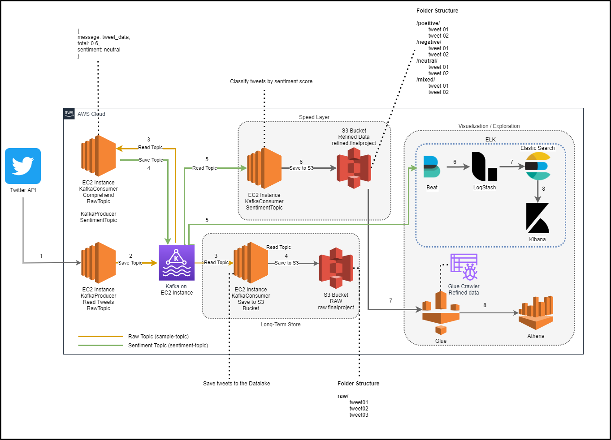

# Analisis de Sentimientos (Opiniones Politicas)
- Mateo Tapias A.
- Mateo Gutierrez

## Descripcion
Se buscar observer la opinion politica en Twitter de los ciudadanos, sobre algunas figuras politicas de la sociedad colombiana.

Para esto, se utilizara las siguientes tecnologias en el servicio de nube AWS. 
> Mas informacion en el siguiente diagrama.

- Twitter API
- Kafka
- EC2 instances
- S3 Buckets
- Glue
- Athena
- Logstash
- Kibana

## Arquitectura (Kappa)
Arquitectura de referencia utilizada: https://docs.microsoft.com/en-us/azure/architecture/data-guide/big-data/#kappa-architecture




## Flujo Datos
El flujo de datos en el proyecto es de la siguiente manera.

1. Se capturan los datos (tweets) a traves de la API de twitter.
2. Con un script de Python que actua como productor de Kafka, se envian los tweets al topic `raw-topic`
3. A partir de este `raw-topic`, existen dos consumidores.
	- Un script de Python que actuan como un consumidor 01, con el objetivo de guardar los tweets sin modificar en el Datalake
	- Un script de Python que actua como un consumidor 02, que buscar realizar el analisis de sentimiento en los mensajes de los tweets
4. El consumidor 02, tambien actua como un productor para el topico de Kafka `sentiment-topic`. Luego de realizar el analisis de un tweet, este consumidor 02 se encarga de publicarlo en el topic anterior.
5. El consumidor 03, un script de Python que se encarga de consumir el topico `sentiment-topic` y de acuerdo a la classificacion de cada tweet, lo almacena en un bucket de S3 `refined-data`.
6. Luego tenemos a AWS Glue, que se encarga de indexar este bucket `refined-data` y a traves de Athena, podemos explorar los datos refinados.
7. Tambien se utiliza Logstash para consumir estos datos refinados desde el bucket de S3 y permitis su visualizacion en Kibana.

# Setup

## Kafka Server
Install OpenJDK and download Kafka.
```
apt-get install openjdk-8-jre`
wget https://archive.apache.org/dist/kafka/2.8.0/kafka_2.12-2.8.0.tgz
tar -xzf kafka_2.12-2.8.0.tgz
```

Start Zookeeper and Kafka server.
> **Note:**
> Change the public dns variable PUBLIC_DNS for the EC2 domain name.
```
export  PUBLIC_DNS='XXXXXXX'

cd kafka_2.12-2.8.0
bin/zookeeper-server-start.sh -daemon config/zookeeper.properties

sed s/advertised.listeners=/advertised.listeners=PLAINTEXT://ec2-54-175-184-211.compute-1.amazonaws.com:9092/g kafka_2.12-2.8.0/config/server.properties

bin/kafka-server-start.sh -daemon config/server.properties
```

Create Kafka topics
```
# Raw Topic
bin/kafka-topics.sh --create --zookeeper localhost:2181 --replication-factor 1 --partitions 1 --topic sample-topic

# Sentiment Topic
bin/kafka-topics.sh --create --zookeeper localhost:2181 --replication-factor 1 --partitions 1 --topic sentiment-topic
```

## Twitter Consumer
Create a EC2 instance with the following specifications.


Configure the security groups to allow inbound traffic to the EC2 instance.


Download and run this script [twitter.py.py](../_resources/twitter.py.py)

## Raw Topic Consumer
- S3 Bucket
Create a S3 bucket with the following name and policy
**Name:** raw.finalproject
```json
{
    "Version": "2012-10-17",
    "Id": "Policy1636854719673",
    "Statement": [
        {
            "Sid": "Stmt1636854716548",
            "Effect": "Allow",
            "Principal": "*",
            "Action": "s3:PutObject",
            "Resource": "arn:aws:s3:::raw.finalproject/*"
        }
    ]
}
```

- Consumer

Download this script [save_to_raw.py](../_resources/save_to_raw.py) on the EC2 instance and run it.

```
python3 save_to_raw.py
```

## Sentiment Topic Consumer/Producer
- Consumer / Producer
Download this script [comprehend.py](../_resources/comprehend.py.py) on the EC2 instance, then run it.

```
python3 comprehend.py
```

## Refined
- S3 Bucket
Create a S3 bucket with the following name and policy
**Name:** refined.finalproject
```json
{
    "Version": "2012-10-17",
    "Id": "Policy1636854719673",
    "Statement": [
        {
            "Sid": "Stmt1636854716548",
            "Effect": "Allow",
            "Principal": "*",
            "Action": "s3:PutObject",
            "Resource": "arn:aws:s3:::refined.finalproject/*"
        }
    ]
}
```

- Consumer
Download this script [save_to_refined.py](../_resources/save_to_refined.py) on the EC2 instance and run it.

```
python3 save_to_refined.py
```

## Glue and Athena
Create a crawler for the `refined.finalproject` S3 Bucket.


Create a S3 Bucket for storing Athena results. Add this policy to the Bucker permissions.
**Name:** athena.results.finalproject
```json
{
   "Version": "2012-10-17",
   "Statement": [
     {
       "Sid": "SaveAthenaResulst",
       "Principal": "*",
       "Action": [ 
         "s3:ListBucket",
         "s3:GetBucketAcl",
         "s3:GetObject",
         "s3:PutObject"
       ],
       "Effect": "Allow",
       "Resource": [
					"arn:aws:s3:::athena.results.finalproject",
					"arn:aws:s3:::athena.results.finalproject/*"
       ]
     }
   ]
}
```
