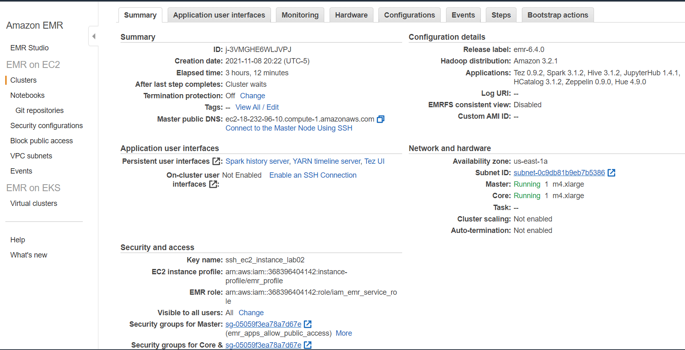

# Lab 02_03 - EMR

The following resources were created with Terraform. The code can be found in the infrastructure folder.

## Resources

**S3 Buckets**

****

**Datalake**

> Taken from: https://www.datos.gov.co/Salud-y-Protecci-n-Social/Casos-positivos-de-COVID-19-en-Colombia/gt2j-8ykr/data

- Bucket with Colombia Covid-19 data.

**Glue**

- Crawler
    
- Schema/Database
    

**Athena**

- Query Editor

**EMR**

- Cluster
    
- Deployed applications
    

**Hue**

- Query data from Glue Database

**Jupyter**

- Notebook