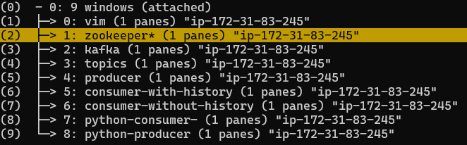
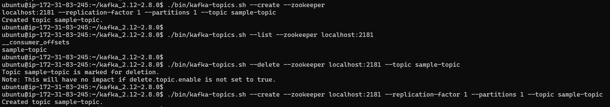
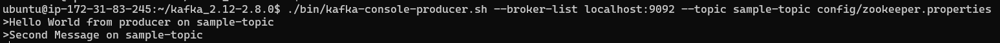
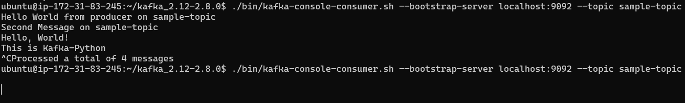

# Lab 04
## Guide
- [Lab 04 Kafka](../_resources/Lab4-kafka-20212.pdf)
- [Lab 04 Repository](https://github.com/st1612eafit/st1612_20212/tree/main/kafka)

## Overview
Tmux session with every needed program running.

### Kafka
1.  Topics:
    
    
2.  Producers
    
    
3.  Consumers with history:
    
    
4.  Consumer without history:
    
    
5.  Python Consumer
    
    
6.  Python Producer
    