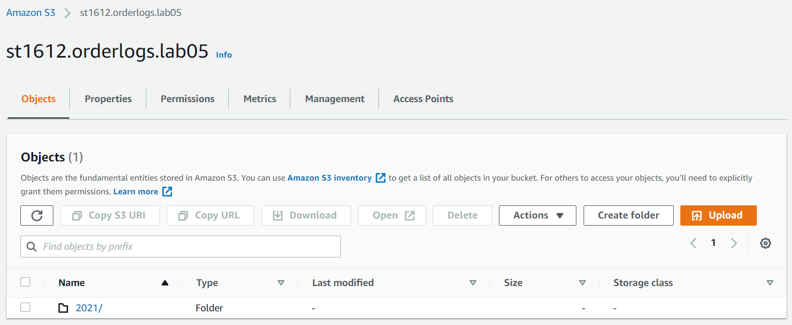

# Lab 05
## Guide
- [Lab 05 AWS Kinesis](../_resources/Lab5-aws-kinesis-20212.docx)
- [Lab 05 Repository](https://github.com/st1612eafit/st1612_20212/tree/main/kinesis)

## Resources
- EC2 Instance
**NOTE: Instead of creating a new role, I modified the default role that AWS creates for new EC2 machines with the appropriated permissions from the lab guide.**

- Dynamo DB

    
- Lambda with Kinesis trigger

    
- AWS Kinesis Delivery Stream

- AWS Kinesis Data Stream

    
- S3 Bucket

    

## Kinesis Configuration
### Local
- Kinesis Agent

    
- logs:

    
- Local Consumer to DynamoDB

    

### Lambda
1.  Lambda Source Code

    
2.  Delete items for lambda upload

    
3.  Dynamo Items from Lambda

