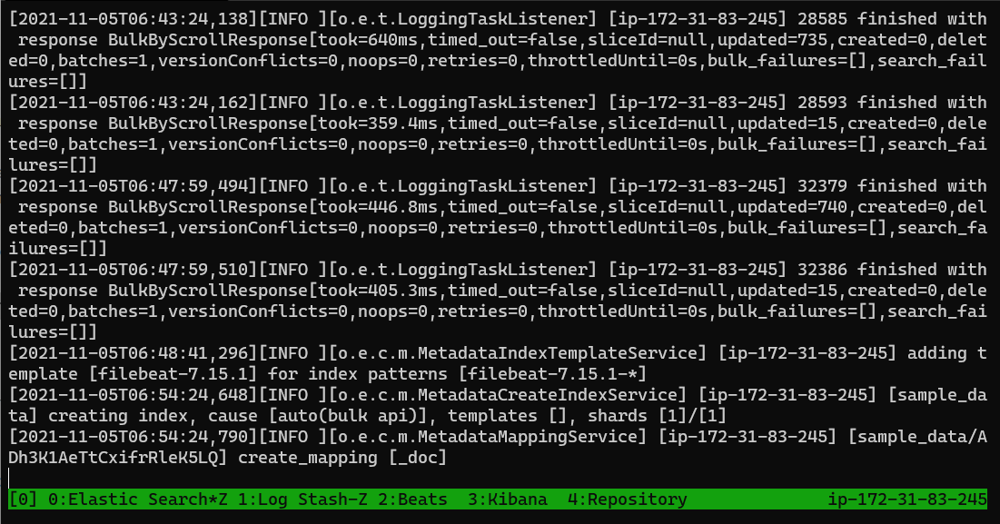
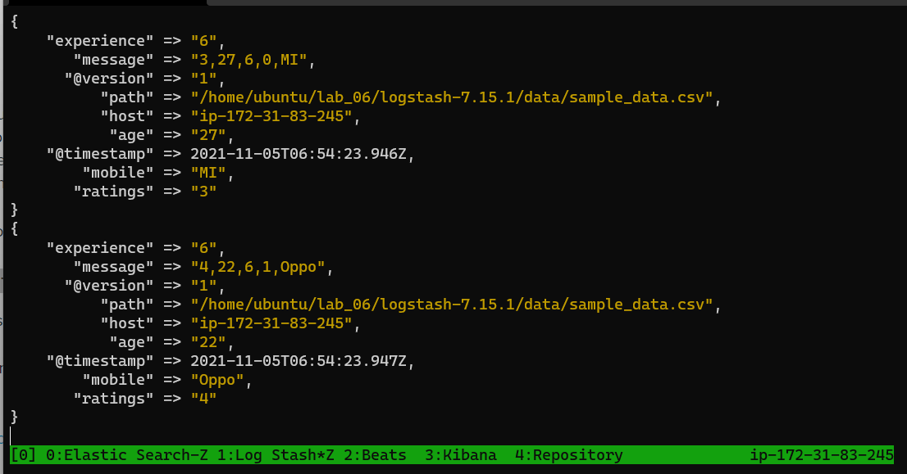
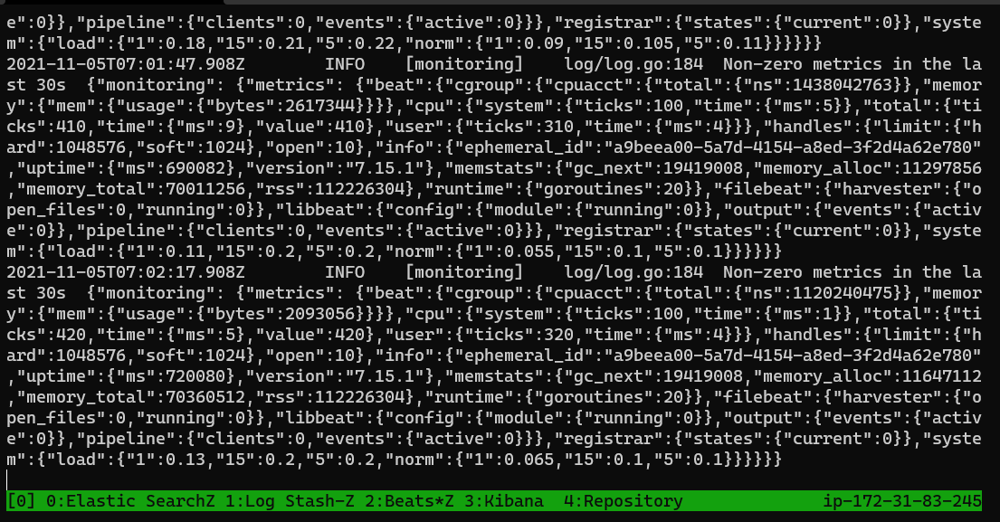
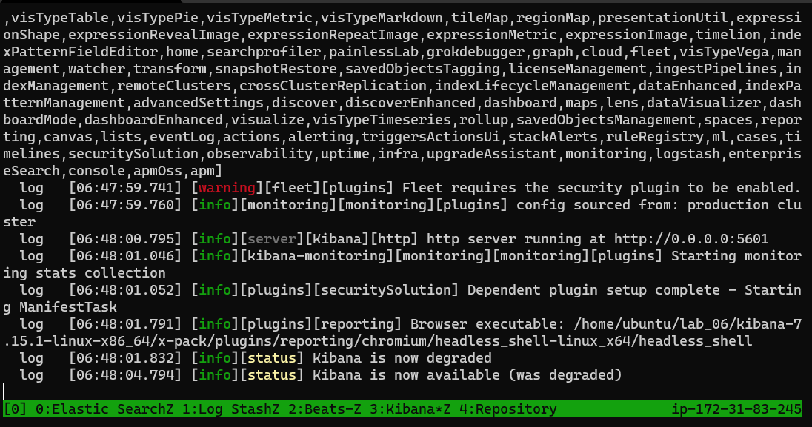
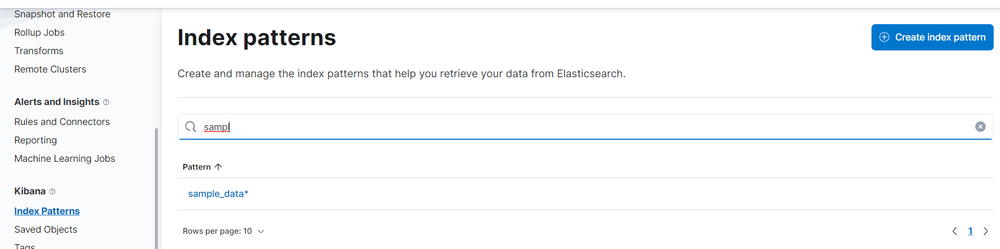
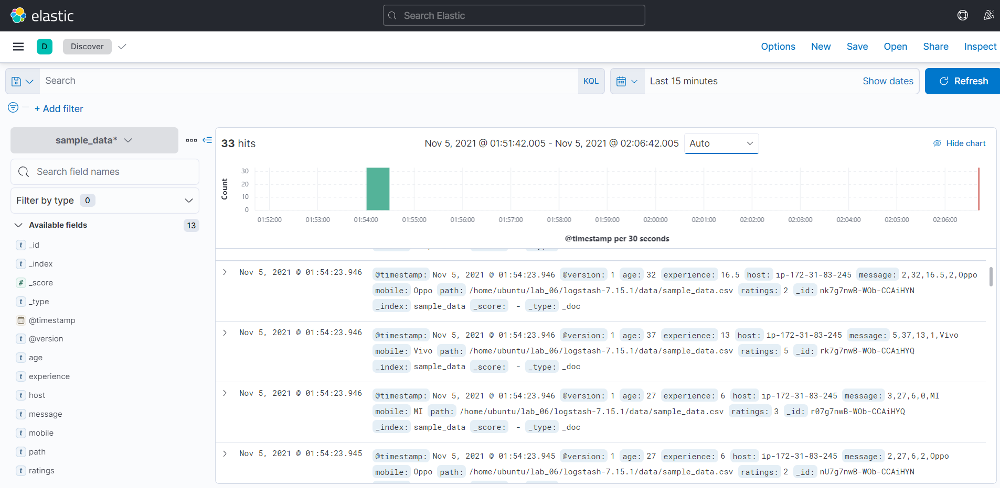
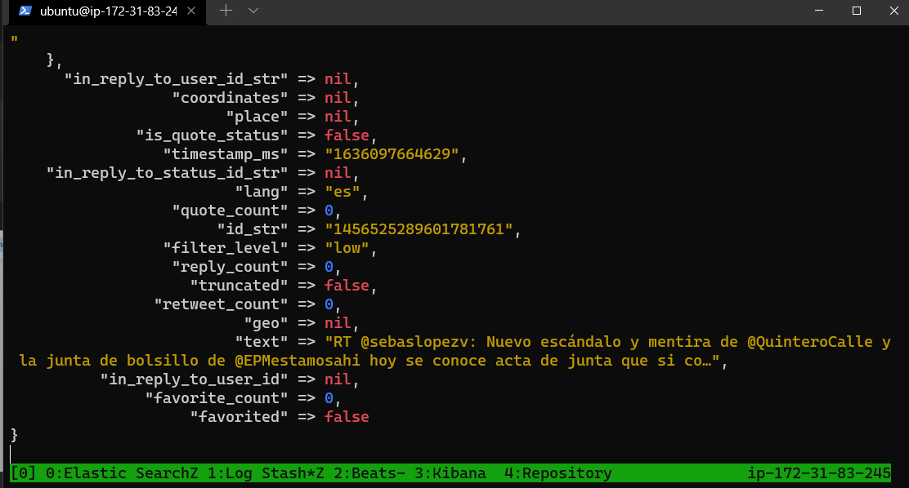
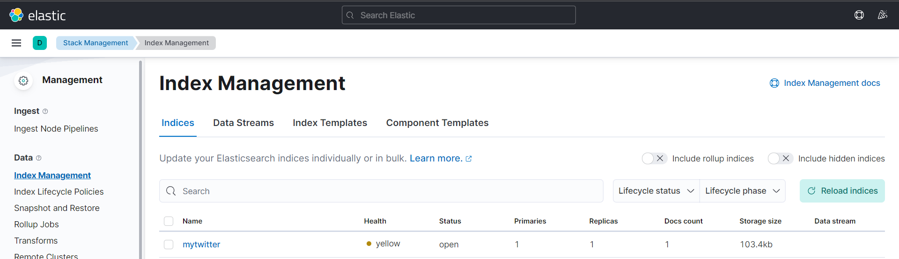
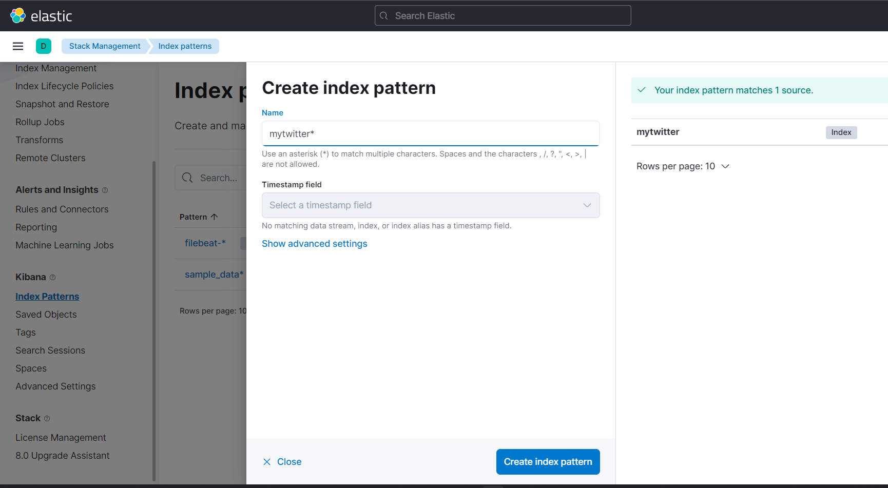
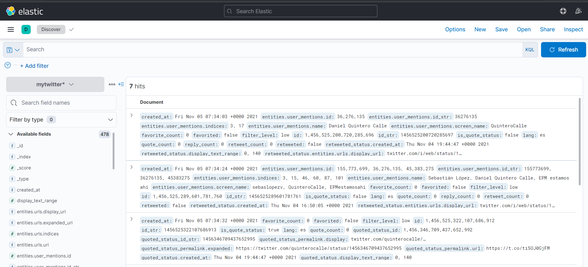

# Lab 06

## Guide

- [Lab 06 Guide](../_resources/8ad27cf31dfaecce91c4ef8ca78eafb2.pdf)
- [Lab 06 Repository](https://github.com/st1612eafit/st1612_20212/tree/main/elk)

## Applications

- Elastic Search
- LogStash
- Beats
- Kibana

## Sample Data

Transform data from the `sample_data.csv` in `LogStash` and then load the result into `ElasticSearch`

- Verify index was created
- Create the Index Pattern
- Inspect the data

## Twitter  Feed

- LogStash with Twitter
- Kibana Twitter Index
- Create Twitter Index Pattern
- Check Twitter Data